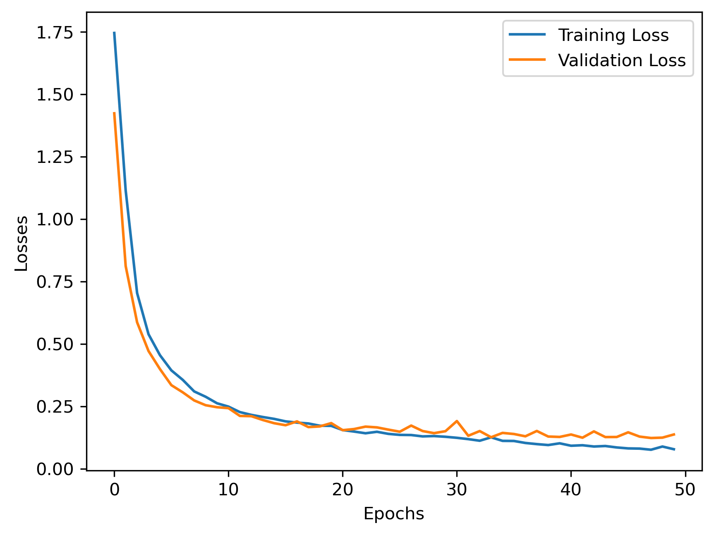

#  Deep Learning ANN for Multi-Class Classification on DateFruit Dataset

## 📌 Project Overview

This project focuses on building a deep learning-based classification model using an Artificial Neural Network (ANN) to classify different types of date fruits based on their physical and statistical features.

The dataset contains multiple numerical attributes representing characteristics such as size, shape, texture, and color distribution. The goal is to accurately classify date fruits into categories like **DOKOL, SAFAVI, ROTANA, DEGLET, SOGAY, IRAQI, and BERHI**.

---

##  Objective

* Perform Exploratory Data Analysis (EDA) to understand data distribution and quality
* Apply preprocessing techniques such as encoding and feature scaling
* Build an ANN model from scratch using PyTorch
* Train and evaluate the model for multi-class classification
* Analyze model performance and generalization capability

---

##  Dataset Information

* Total samples: ~900
* Features: 30+ numerical features
* Target: Multi-class labels (7 classes)

### Example Features:

* AREA
* PERIMETER
* MAJOR_AXIS
* MINOR_AXIS
* ECCENTRICITY
* SHAPEFACTORS
* COLOR DISTRIBUTIONS

---

##  Exploratory Data Analysis (EDA)

Key observations:

* Dataset is clean with no missing or duplicate values
* Slight class imbalance observed across categories
* Strong correlations exist between several numerical features
* Feature distributions are stable and suitable for modeling
* Outliers are present but represent natural variations

---

##  Data Preprocessing

Steps performed:

* Label Encoding for target variable
* Train-Test Split (80-20)
* Feature Scaling using StandardScaler
* Conversion to PyTorch tensors
* Data loading using TensorDataset and DataLoader

---

##  Model Architecture (ANN)

* Input Layer: Based on number of features
* Hidden Layers: Fully connected layers with ReLU activation
* Regularization: Dropout layers to prevent overfitting
* Output Layer: 7 neurons (multi-class classification)

---

##  Training Process

* Loss Function: CrossEntropyLoss
* Optimizer: Adam
* Batch Size: 32
* Epochs: 50

Training includes:

* Forward propagation
* Loss computation
* Backpropagation
* Weight updates

---

##  Model Performance

* Training and validation loss show consistent decrease
* Model converges effectively after ~38 epochs
* Achieved **~95% accuracy** on test data
* Good balance between learning and generalization


## 📈 Training vs Validation Loss

<p align="center">
  
</p>

---

##  Evaluation Metrics

### Accuracy Score : **95.56%**
  
### Classification Report (Precision, Recall, F1-score) :

| Class | Precision | Recall | F1-Score | Support |
|-------|-----------|--------|----------|---------|
|  0    |      0.92 |   0.92 |     0.92 |      12 |
|     1 |      0.89 |   0.80 |     0.84 |      20 |
|     2 |      0.96 |   0.98 |     0.97 |      50 |
|     3 |      0.90 |   0.90 |     0.90 |      10 |
|     4 |     1 .00 |   1.00 |     1.00 |      35 |
|     5 |      1.00 |   1.00 |     1.00 |      33 |
|     6 |      0.90 |   0.95 |     0.93 |      20 |

**Macro Avg:** Precision: 0.94 | Recall: 0.94 | F1: 0.94  
**Weighted Avg:** Precision: 0.96 | Recall: 0.96 | F1: 0.95  

---

##  Challenges & Learnings

* Incorrect feature scaling initially led to unstable validation loss
* Learned importance of fitting scaler only on training data
* Faced issues with tensor shapes and target formatting
* Improved understanding of loss functions and data flow
* Gained hands-on experience in debugging deep learning pipelines

---

##  Key Insights

* Feature scaling is critical for neural network stability
* Proper tensor formatting is essential for correct training
* Loss curves help diagnose overfitting and convergence
* ANN can effectively learn complex patterns from tabular data

---

##  Future Improvements

* Hyperparameter tuning
* Try advanced architectures (CNN, TabNet)
* Use cross-validation
* Deploy model as a web application

---

## 🚀 Tech Stack

* Python
* Pandas, NumPy
* Matplotlib, Seaborn
* PyTorch
* Scikit-learn

---

## 📌 Project Structure

```bash
ann-classification-project/
│
├── ANN_classification.ipynb     # Main notebook (EDA + Model)
├── DateFruit_Dataset.csv        # Dataset
├── best_ann_classifier.pt       # Saved trained model
├── requirements.txt             # Dependencies
├── README.md                    # Project documentation
├── .gitignore                   # Ignored files
│
└── results/                     # Output visuals
    └── loss_curve.png
```

---

## ▶️ How to Run

1. Clone the repository
```bash
git clone https://github.com/sonakshigupta29/ann-classification-project.git
cd ann-classification-project
```
2. Install dependencies
```bash
pip install -r requirements.txt
```
3. Open the notebook
```bash
jupyter notebook ANN_classification.ipynb
```
4. Run all cells sequentially
